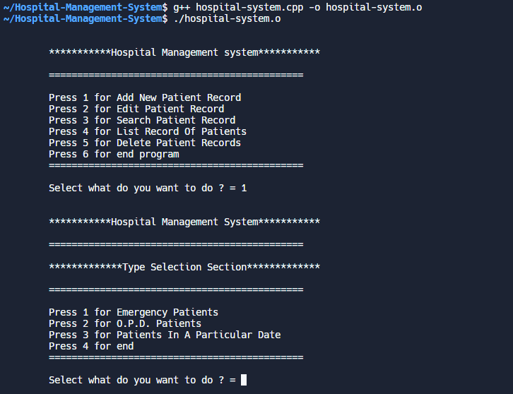

# Hospital-Management-System
This system is written in C++ to manage and keep record of patients in different departments. Admin can add, delete or edit patient from the record. Also through management system admin can view the detail of any patient. All of the patient data would be store locally and used later when needed.

## Screenshot

